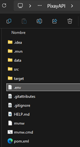
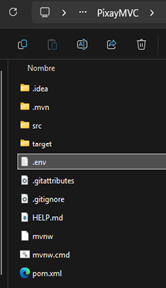
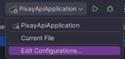
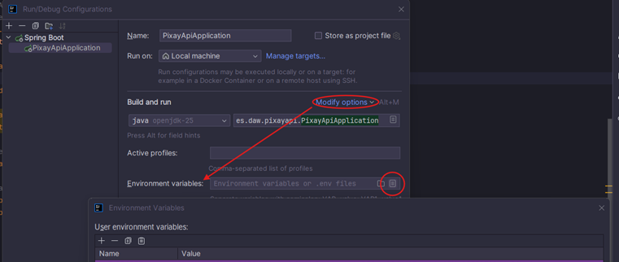

# GUÍA DE INSTALACIÓN Y DESPLIEGUE

### Requisitos previos
*   Java JDK 25 o superior.
*   Maven 3.x.

### Configuración
1. Clonar repositorio: `git clone https://github.com/Freyja96/Pixay.git`
2. Abrir en ventanas separadas de IntelliJ tanto PixayAPI como PixayMVC
3. Ubicar el archivo `.env` en las raíces de `PixayAPI` y `PixayMVC`.

4. Añadir variable: `JWT_SECRET=TuClaveBase64` y `JWT_EXPIRATION=24` en Edit Configurations de IntelliJ, tanto en el MVC como en la API.

5. Descomentar la línea 16 indicada en application.properties de la API (spring.sql.init.mode=always)
6. Ejecutar API
7. Ejecutar MVC

### Ejecución
1. **API (Puerto 8081):** `cd PixayAPI && mvn spring-boot:run`
2. **MVC (Puerto 8080):** `cd PixayMVC && mvn spring-boot:run`
3. Acceso: `http://localhost:8080`